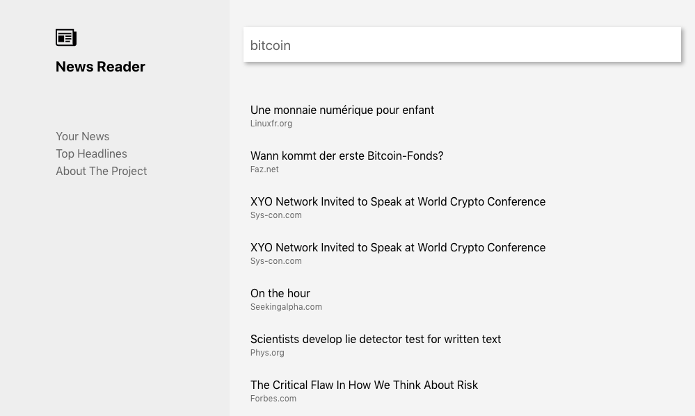

# News Reader
Welcome to News Reader!  
This is an app that allows you to retrive some top news about a specific topic described by keywords. It also provides you with the latest top headings from newspapers all around the world.




## Getting started
Start by cloning this repo on your machine. Install all dependencies typing `$ yarn` in your terminal.

In order for the news API to work correctly you need to register for free at [newsapi.org](https://newsapi.org/) and get your key. To use it in this project save it as follows in a file named `apikey.js` placed in the `src/redux/` folder:

```javascript
export const API_KEY = 'YOUR_API_KEY_HERE';
```

Please note that this project may connect to Redux DevTools for an easy tracking of what's happening in the Redux store. To activate the feature, install the DevTools extension ([click here for the Chrome Web Store](https://chrome.google.com/webstore/detail/redux-devtools/lmhkpmbekcpmknklioeibfkpmmfibljd?hl=en-GB)) and uncomment the following lines in `src/indexjs`:

```javascript
const reduxDevTools =
  window.__REDUX_DEVTOOLS_EXTENSION__ && window.__REDUX_DEVTOOLS_EXTENSION__();
```

Then edit the `createStore()` function as follows:

```javascript
let store = createStore(
  reducers,
  compose(applyMiddleware(sagaMiddleware),
  reduxDevTools)
);
```

## Run the app and/or build for prod
To launch the project in development mode just type in the terminal `$ yarn start`. To create a production build, use `$ yarn build`.

## Credits
This project was bootstrapped with [Create React App](https://github.com/facebook/create-react-app).  
News data provided by newsapi.org.